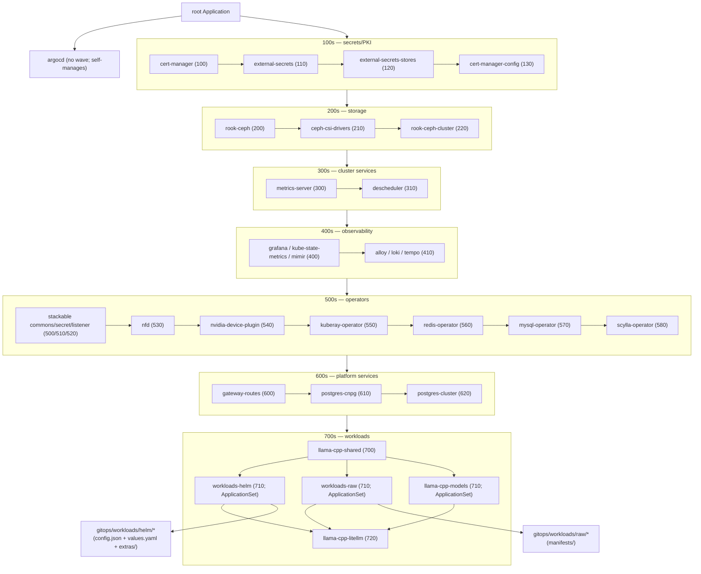

# homelab

Single-cluster Kubernetes homelab on Proxmox. Terraform provisions VMs, Ansible bootstraps the cluster, Argo CD owns everything thereafter.

## Architecture

```
Terraform → Proxmox VMs / disks / cloud-init
   ↓
Ansible  → OS, kubeadm, API VIP, Cilium (full lifecycle), NVIDIA host stack,
           minimal Argo CD + AppProjects, one Vault bootstrap Secret,
           apply root Application (Argo CD then reconciles on its own)
   ↓
Argo CD  → everything else, including its own chart/config
```

### Ownership

- **Terraform** never touches Kubernetes objects.
- **Ansible** owns bootstrap only. It applies the root Application and hands reconciliation to Argo CD, then applies Cilium post-bootstrap features — waiting only for the specific platform resources those features depend on. Platform and workload Applications are otherwise left for Argo CD to reconcile after bootstrap.
- **Argo CD** reconciles all other in-cluster state via the root Application and the workload ApplicationSets. The one deliberate exception is Cilium, which Ansible owns end-to-end.

### Argo CD shape

The root Application (App-of-Apps over `gitops/cluster/applications/`) manages
every node below; arrows show sync-wave order — the root app applies each
wave's child Applications before the next wave's. Waves stagger rollout but do
not gate on child workload health: no `argoproj.io/Application` health
customization is configured, so each child app syncs and retries on its own
schedule once created. Apps sharing a wave are applied concurrently.



ApplicationSet-generated workloads sync concurrently within wave 710. Enabled
workloads come from explicit `elements` lists in `workloads-helm.yaml` and
`workloads-raw.yaml`; commenting out a line disables and prunes that workload.

### Persistent stores

- **HashiCorp Vault** (external) — only persistent source of truth besides Git. Auth via AppRole with `secret_id_ttl=0` and `secret_id_num_uses=0`.
- **Rook-Ceph** — block (`rook-ceph-block`, default), CephFS (`rook-cephfs`, RWX), and an object store consumed through `ExternalSecret`-driven copies of Rook-produced RGW Secrets.
- **CloudNativePG** — three-instance Postgres cluster at `postgres-cluster-rw.postgres-cluster`. Airflow, Superset, Hive, and Jupyter create their users/databases with Sync-hook Jobs at wave -1; superuser credentials flow from Vault into a `postgres-cluster-superuser` Secret.

### TLS

`cert-manager-config` provisions Let's Encrypt `ClusterIssuer`s (`letsencrypt-prod` + `letsencrypt-staging`) using a Cloudflare DNS-01 solver, then issues `homelab-wildcard-tls` in `gateway-system` for `*.homelab.xiehang.com`. The Gateway terminates TLS on 443; upstream services speak plain HTTP. The Cloudflare API token comes from Vault (`cloudflare/api-token`) via an `ExternalSecret`. Browsers trust LE out of the box — no operator-side CA import.

## First-time bootstrap

End-to-end provisioning of a fresh homelab cluster from this repo plus an external Vault.

### Prerequisites

- Operator workstation with `terraform`, `ansible`, `kubectl`, `helm`, `vault`,
  `jq`, `yq`, and `openssl` on PATH.
- Reachable Proxmox cluster, SSH agent loaded with the key used for VM access.
- External HashiCorp Vault reachable at `registry.xiehang.com:8200`.
- DNS `*.homelab.xiehang.com` pointed at the Gateway VIP (registered manually post-bootstrap).
- `xiehang.com` zone hosted on Cloudflare, with a scoped API token (`Zone:DNS:Edit` on `xiehang.com` only) ready for cert-manager's DNS-01 solver.
- Public HTTPS access to `https://github.com/hangxie/homelab.git`.

### Steps

```bash
export VAULT_ADDR=https://registry.xiehang.com:8200
export VAULT_TOKEN=...   # operator token with admin perms

# 1. Ensure the KV v2 mount exists so generate:false entries can be pre-loaded.
vault secrets list -format=json | jq -e '."homelab/"' >/dev/null \
  || vault secrets enable -path=homelab -version=2 kv

# 2. Pre-load externally minted credentials (see "Secrets" below).
#    Required because seed-vault.sh refuses to generate placeholders for these.
vault kv put homelab/harbor/llm-models \
  username='robot$llm-models+ci' \
  password='<secret from Harbor>'
vault kv put homelab/huggingface/api-token \
  token='<read token from HuggingFace>'
vault kv put homelab/cloudflare/api-token \
  api-token='<scoped token from Cloudflare>'

# 3. Seed Vault (sets up AppRole/policy and generates random passwords for everything else).
scripts/seed-vault.sh

# 4. Provision infrastructure.
cd terraform
terraform init
terraform apply
cd ..

# 5. Bootstrap the cluster. This runs the API VIP, kubeadm, Cilium bootstrap,
#    node joins, kubeconfig finalization, NVIDIA host stack, Argo CD,
#    Vault AppRole Secret, root/platform convergence, then Cilium post-bootstrap.
ansible-playbook \
  -i ansible/inventory.ini \
  ansible/bootstrap-k8s.yml

# 6. Point DNS at the Gateway VIP.
#    Add a wildcard A record: *.homelab.xiehang.com -> 192.168.0.219
```

### Secrets

`scripts/seed-vault.sh` auto-generates random passwords for everything except
externally minted credentials marked `generate: false` in
`scripts/vault-secrets.template.yaml`. Those must be written to Vault directly
with the same `VAULT_TOKEN` used for seeding. Current entries:

- `harbor/llm-models` — Harbor robot account used by Ray and llama-cpp init
  containers, plus `kubectl llama-model` / `kubectl vllm-model`, to manage the
  model cache.
- `huggingface/api-token` — HuggingFace read token used by Ray and llama-cpp
  model-pull init containers. Anonymous HuggingFace downloads are not allowed.
- `cloudflare/api-token` — scoped Cloudflare API token used by cert-manager's
  DNS-01 solver to issue Let's Encrypt wildcard certs.

Re-running `scripts/seed-vault.sh` is idempotent: existing Vault values are kept.
To rotate the auto-generated secrets, run `scripts/seed-vault.sh --regenerate`,
which mints fresh values even where Vault already has one. Template-pinned
defaults (usernames) and the `generate: false` credentials above are left
untouched. This is a live rotation on a running cluster: each `vault kv put`
bumps the KV version, so the dependent `ExternalSecret`s must re-sync and their
consuming pods restart before the new secrets take effect. Force a re-sync with
`kubectl -n <ns> annotate externalsecret <name> force-sync=$(date +%s) --overwrite`,
then roll the affected workloads.

Public vLLM and llama-cpp `/v1` endpoints are currently unauthenticated.
Bearer-token enforcement is deferred until a dedicated API gateway is added.

DBeaver/CloudBeaver is intentionally not Vault-seeded. It is an internal
admin-only tool, and the first browser login creates the CloudBeaver admin in
the workspace PVC. `kubectl list-endpoints` reports that setup step instead
of a Vault-backed credential.

Headlamp is intentionally not Vault-seeded. It uses operator-issued
ServiceAccount tokens (no static credential). The chart provisions the
`headlamp` ServiceAccount and binds it to `cluster-admin`. To log in,
mint a short-lived token against that SA and paste it at the login
screen:

```bash
kubectl -n headlamp create token headlamp --duration=8h
```

`scripts/list-endpoints.sh` reports that step instead of a Vault-backed
credential.

OpenWebUI's admin user is seeded by a PostSync `openwebui-admin-bootstrap`
Job that verifies the fixed `admin@homelab.xiehang.com` account with the
Vault-backed password, or calls the signup API on first bootstrap. The first
signup is auto-promoted to admin by OpenWebUI; subsequent signups land in
`pending` (see `DEFAULT_USER_ROLE`) and may be blocked by OpenWebUI's
persisted signup setting. Like Airflow, rotating the Vault password does not
propagate to OpenWebUI on its own — change it in the UI, or wipe the
`open-webui` PVC and let the Job re-seed on the next sync.

#### Rotate Harbor credentials

1. Rotate the robot account in Harbor for the `llm-models` project.
2. Overwrite the Vault entry (a single `kv put` replaces the whole secret):

   ```bash
   vault kv put homelab/harbor/llm-models \
     username='robot$llm-models+ci' \
     password='<new secret from Harbor>'
   ```

3. Force the `harbor-credentials` Secret in both namespaces to refresh from
   Vault immediately (otherwise wait for the 1h ExternalSecret refresh):

   ```bash
   for ns in llama-cpp ray; do
     kubectl -n "$ns" annotate externalsecret harbor-credentials \
       force-sync=$(date +%s) --overwrite
   done
   ```

#### Rotate the Cloudflare API token

1. Mint a new scoped token in the Cloudflare dashboard
   (`Zone:DNS:Edit` on `xiehang.com` only).
2. Overwrite the Vault entry:

   ```bash
   vault kv put homelab/cloudflare/api-token \
     api-token='<new token from Cloudflare>'
   ```

3. Force the `cloudflare-api-token` Secret to refresh:

   ```bash
   kubectl -n cert-manager annotate externalsecret cloudflare-api-token \
     force-sync=$(date +%s) --overwrite
   ```

4. Revoke the old token in the Cloudflare dashboard once cert-manager has
   successfully renewed (`kubectl -n gateway-system describe certificate
   homelab-wildcard`).

#### Rotate the HuggingFace API token

1. Mint a new read token at `https://huggingface.co/settings/tokens`.
2. Overwrite the Vault entry:

   ```bash
   vault kv put homelab/huggingface/api-token \
     token='<new HuggingFace read token>'
   ```

3. Force the `hf-token` Secret in both model namespaces to refresh:

   ```bash
   for ns in llama-cpp ray; do
     kubectl -n "$ns" annotate externalsecret hf-token \
       force-sync=$(date +%s) --overwrite
   done
   ```

### Verification

```bash
kubectl get applications -n argocd
kubectl get applicationsets -n argocd
kubectl get cephcluster -n rook-ceph
kubectl get certificate -A
kubectl get clustersecretstore vault-homelab
kubectl get nodes -L feature.node.kubernetes.io/pci-10de.present
kubectl -n kube-system exec ds/cilium -- cilium-dbg status --brief
kubectl get cluster -n postgres-cluster postgres-cluster -o jsonpath='{.status.phase}'
```

Browse `https://grafana.homelab.xiehang.com` and `https://argocd.homelab.xiehang.com`.

## Rebuild modes

Routine changes live in the values files and don't require either of these.

### Reset (cluster broken, VMs fine)

```bash
ansible-playbook -i ansible/inventory.ini ansible/reset.yml
ansible-playbook -i ansible/inventory.ini ansible/bootstrap-k8s.yml
```

Survives: VM identities, IPs, host packages, Vault data, this repo.
Destroys: every byte inside the cluster (Postgres, Ceph, Mimir metrics, Loki logs, Tempo traces, models, etc.).
Time: ~15–20 min Ansible + ~10–15 min Argo CD first-sync.

### Nuke (re-cut from infrastructure up)

```bash
cd terraform && terraform destroy
# edit terraform.tfvars / variables.tf as needed
terraform apply
cd ..
ansible-playbook -i ansible/inventory.ini ansible/bootstrap-k8s.yml
```

Survives: only Vault and Git.
Destroys: VMs, disks, all cluster state.

### What is *not* covered

- Live migration / blue-green cutover.
- In-cluster backup/restore — DR is deferred.
- Partial node replacement while a cluster is healthy — use `scripts/remove-worker.sh` ad-hoc.
- Vault unavailable. The cluster cannot fully converge without Vault; restore Vault from its own backups.

## kubectl plugins

`kubectl-plugins/` contains operator utilities packaged as kubectl plugins.
Symlink them into any directory on your `PATH`:

```bash
mkdir -p ~/.local/bin
for f in kubectl-plugins/kubectl-*; do
  ln -sf "$(pwd)/$f" ~/.local/bin/
done

# Add to PATH if not already present (add to ~/.bashrc or ~/.zshrc to persist)
export PATH="$HOME/.local/bin:$PATH"
```

Verify discovery:

```bash
kubectl plugin list
```

| Plugin | Invocation | Purpose |
|---|---|---|
| `kubectl-df_bucket` | `kubectl df-bucket [storage-class]` | RGW bucket usage for ObjectBucketClaims in a bucket storage class |
| `kubectl-df_pvc` | `kubectl df-pvc <storage-class>` | Disk usage for all PVCs in a storage class |
| `kubectl-list_endpoints` | `kubectl list-endpoints` | All HTTPRoute URLs with credentials |
| `kubectl-llama_model` | `kubectl llama-model list\|delete` | Manage GGUF models on the llama-cpp PVC |
| `kubectl-vllm_model` | `kubectl vllm-model verify\|list\|delete` | Manage vLLM models on PVC and Harbor |

## Repo layout

- `terraform/` — Proxmox VMs, disks, cloud-init, and generated `ansible/inventory.ini`; passes `kube_api_vip` to Ansible.
- `ansible/` — kubeadm, API VIP, Cilium, NVIDIA host stack, minimal Argo CD + AppProjects, Vault bootstrap Secret, root Application, and Cilium post-bootstrap.
- `gitops/cluster/` — root Application and per-component Application/ApplicationSet manifests.
- `gitops/platform/` — Helm values and supporting CRs for platform components.
- `gitops/workloads/helm/<name>/` — `config.json` (`chart_repo`, `chart_name`, `chart_version` only; validated by `gitops/workloads/.schema.json`), `values.yaml`, `extras/` (ExternalSecrets, init Jobs, HTTPRoutes).
- `gitops/workloads/raw/<name>/` — `manifests/` of raw YAML.
- `scripts/` — operator utilities (Vault seed/nuke, node removal, redeploy, Proxmox GPU passthrough).
- `kubectl-plugins/` — kubectl plugins for cluster inspection and model cache management (see [kubectl plugins](#kubectl-plugins)).
